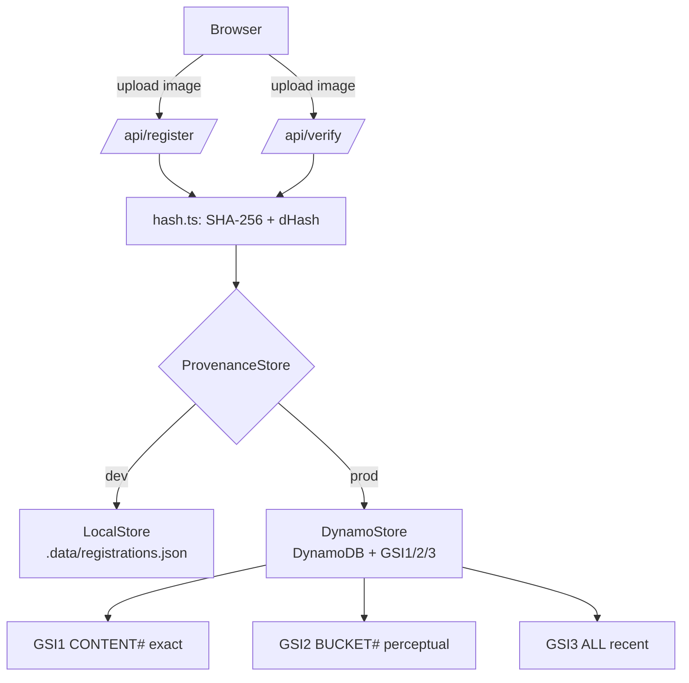

# Architecture

## Overview

Proof of Real is a Next.js application with serverless API routes backed by DynamoDB. It has one job: make media provenance a public, verifiable lookup.

## Request flows

### Register
1. `POST /api/register` (multipart: file, title, registrant)
2. Compute SHA-256 (exact) and dHash (perceptual) with `sharp` on the Node runtime
3. If the content hash already exists → return the existing certificate (idempotent)
4. Else persist a `Registration` with a fresh `nanoid` id and a provenance entry

### Verify
1. `POST /api/verify` (multipart: file)
2. Exact lookup by content hash → **registered-original**
3. Else nearest perceptual fingerprint within Hamming distance 10 → **likely-altered** (+ confidence)
4. Else → **unregistered**

## Data model (DynamoDB single table)

| Access pattern | Index | Key |
|----------------|-------|-----|
| Get by id | base table | `pk=REG#<id>`, `sk=META` |
| Exact original | GSI1 | `gsi1pk=CONTENT#<sha256>` |
| Perceptual candidates (LSH) | base table | `pk=BAND#<i:value>`, one item per band |
| Recent ledger | GSI3 | `gsi3pk=ALL`, sorted by `gsi3sk=createdAt` |

Billing is `PAY_PER_REQUEST`; no capacity planning needed for a hackathon, and it scales to production traffic without change.

## Scalable near-match (LSH banding)

The 64-bit dHash is split into 8 bands. Each registration writes 8 lightweight `BAND#<i:value>` pointer items. Verify runs **one point query per band, in parallel**, unions the candidate ids, and Hamming-ranks them — then fetches only the winning record. Cost is bounded by the number of bands and candidates per band, never by registry size, so there is no table scan on the hot path.

## Tamper-evidence (seal + hash chain)

Each registration is hash-chained (`prevHash` = previous record's `recordHash`) and Ed25519-sealed by the registry key over a canonical projection of its fields. `GET /api/ledger/verify` recomputes each `recordHash`, verifies each seal against the public key, and checks chain linkage — making any field edit, insertion, reorder, or deletion detectable. Keys are supplied via `REGISTRY_PRIVATE_KEY` / `REGISTRY_PUBLIC_KEY` (base64 PEM); generate with `scripts/gen-registry-key.mjs`.

## Why these choices

- **Two hashes, not one.** SHA-256 alone only catches identical files; dHash alone can't prove an exact original. Together they distinguish "the original," "an edit of the original," and "unrelated."
- **Repository pattern.** `ProvenanceStore` lets the app run locally with zero cloud setup and deploy to DynamoDB by flipping one env var — the same code paths in both.
- **Node runtime for API routes.** `sharp` and `node:crypto` need the Node runtime (`export const runtime = "nodejs"`), not edge.
